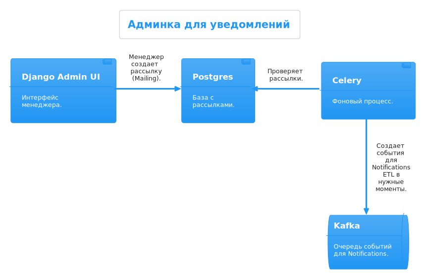
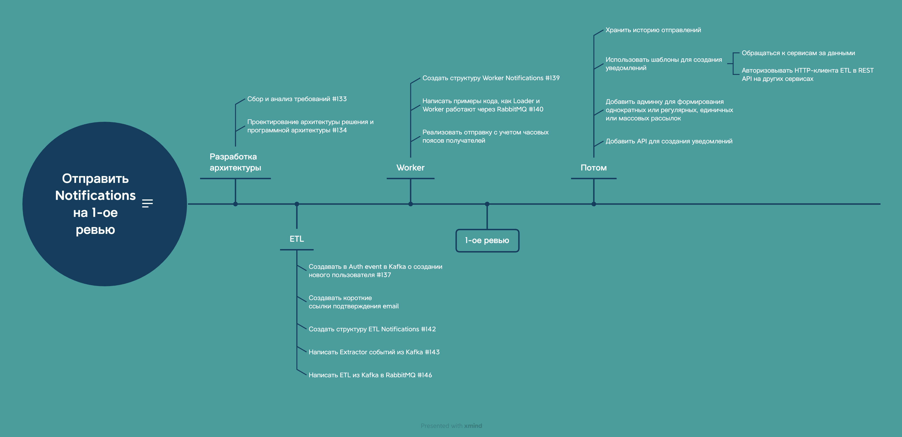
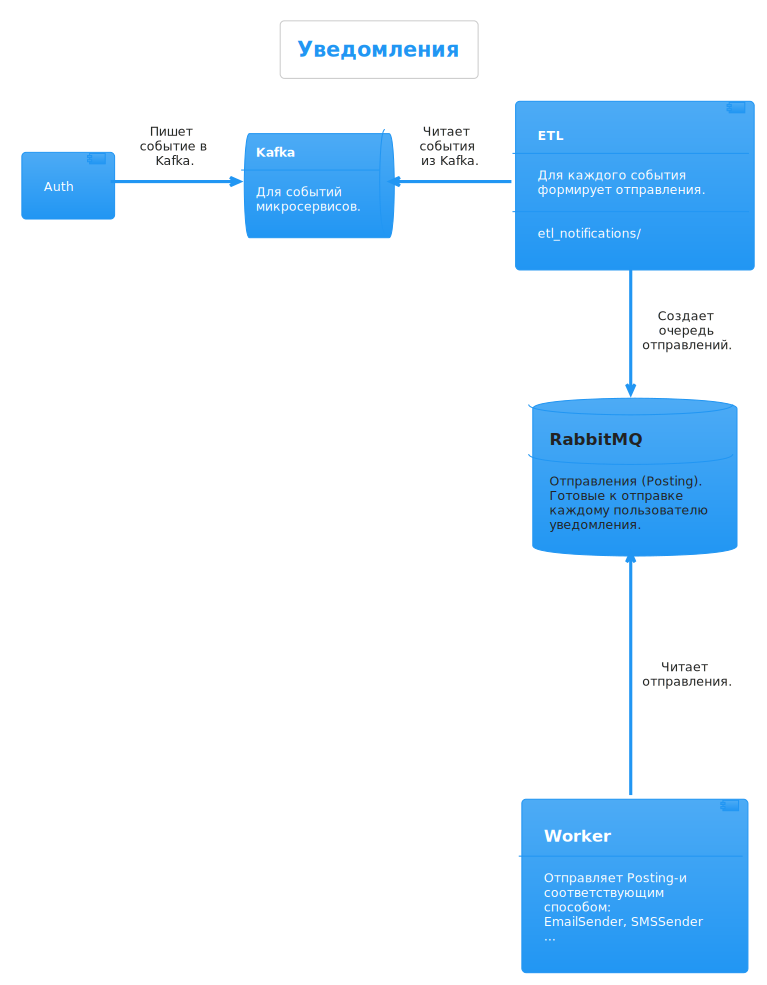
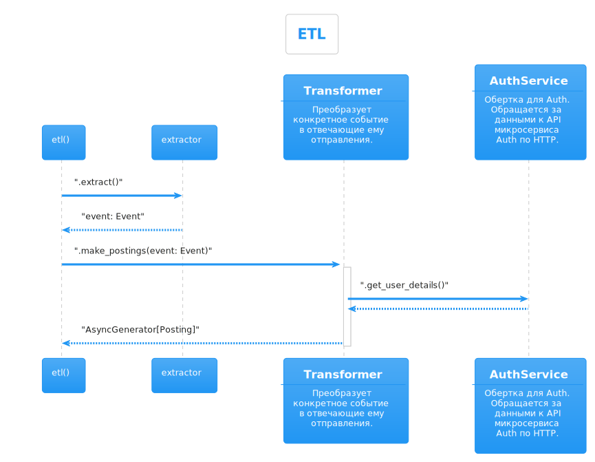

# Репозиторий
[https://github.com/AlexPunches/Async_API_sprint_1](https://github.com/AlexPunches/Async_API_sprint_1)

# Спринт 10

## Ответ на 1-ое ревью

### 1. MailHog

> 1. Для работы с почтой в dev окружении рекомендую https://github.com/mailhog/MailHog. Очень удобный инструмент выступающий в качестве SMTP сервера и web интерфейсом для просмотра всех отправленных сообщений. Вот еще пример https://akrabat.com/using-mailhog-via-docker-for-testing-email/

### 2. Админка для уведомлений

> 2. Допускаю, что я пропустил. Предусмотрена ли у вас какая-нибудь админка для создания рассылок, разовых и регулярных?

Мы представляли себя админку как конструктор для событий о рассылках
(`Mailing`). Где менеджеры определяют даты рассылки, выборку 
пользователей, шаблон. А дальше по нажатию кнопки менеджером или 
по логике, записанной в таске Celery, в Kafka отправляется событие. 
Например, событие о рассылке всем активным пользователям, которые
согласны получать email'ы:

```
{
  "from_service": "mailing", 
  "receivers": "http://auth/api/v1/users/?is_active=True&email_notifications=True&page_number=1&page_size=500",
  "template": "email/new_movies.md",
  "delivery_type": ["email"],
  "template_context": {
    "movies": "http://fastapi/api/v1/movies/?new=True"
  }
}
```

А на стороне `ETL Notifications` такое событие превращалось бы
в отправление каждому пользователю.



Реализовывать админку не стали. В 9-м спринте из-за нехватки времени
на учебу команду оставил Миша Игнатов.  И времени на 10-й спринт у 
оставшихся двоих программистов была от силы неделя. Так что цель была 
такая: реализовать только самый ядерный функционал до первого ревью. 
Остальное -- продумали и отложили на потом.



### 3. Архитектура сервиса уведомлений  

> 3. [можно лучше] Сейчас у вас сервис авторизации отправляет 
> сообщение в очередь для дальнейшей обработки воркером 
> уведомлений. 

Если точнее, `Auth` уведомляет о событии всех заинтересованных через 
`Kafka`.



> Остальные сервисы так же будут взаимодействовать с сервисом 
> уведомлений?

Пока только так. 

> Обычно это работает так:
> 
> Другие сервисы кинотеатра обращаются к сервису нотификации  
> (API или лучше gRPC) для того или иного уведомления пользователя.
> 
> Вот ситуация: пользователь изменил пароль в сервисе авторизации, 
> сервис авторизации просит сервис уведомлений отправить пользователю 
> сообщение, что-то вроде "Пароль изменен....". 
> 
> Или в сервисе выдачи контента, что-то произошло и нужно уведомить 
> пользователя. 

Кому и что отправлять знает микросервис `Notifications ETL`. Если 
пользователь зарегистрировался, или сменил пароль, то `Auth` нужно 
только послать событие типа `"user_signed_up_event"` или 
`"user_changed_password_successfully"`. Как дальше связаться с 
пользователем и что ему написать -- реализовано в `ETL`.

Сейчас идея такая: коммуникация с пользователем -- ответственность 
`Notifications`.  `Auth` не знает, что делать для нового пользователя: 
приветствовать, игнорировать или отправлять новые сериальчики из 
кинотеатра. 

Есть еще `Notifications Worker`. Он отвечает исключительно за отправку
`Posting`. `Posting` в `RabbitMQ` это структура с уже готовым уведомлением, 
и условиями его отправки. Кроме того, чтобы отправить, `Worker` 
может его разве что выбросить. Если его время жизни 
истекло. Ну или отложить отправку до наступления нужного времени суток у 
получателя, если нужно.

> Другие сервисы кинотеатра, которые будут взаимодействовать с этим 
> сервисом уведомлений, не будут иметь полной и актуальной информации 
> о пользователе. У них точно будет id пользователя, а сервис 
> нотификации, должен сходить в сервис авторизации (где у нас лежать 
> актуальные данные пользователя),  забрать данные о пользователе и 
> отправить уведомление.

Да, мы тоже так думали. И добавили в `ETL` этап сборки контекста 
отправлений с других сервисов.  В том числе, c `Auth`. На диаграмме 
этот этап будет внутри метода `Transformer.make_postings(event: Event) -> AsyncGenerator[Posting]`.



`Event`, `Transformer` и `Posting` это интерфейсы, не классы. Конкретные
классы это, например, `UserSignedUpEvent` и `WelcomeUserPosting`. 
Класс `AuthService` в `etl_notifications/` сейчас не реализован.

### Как работает сервис Нотификаций.

В системе происходят всякие разные события. Они о себе сообщают в Кафку.  
На кафку на нужный топик подписан некоторый консюмер (сервис ETL-notification),
  
ETL ожидает события, которые провоцируют отправку сообщений.
Получив событие, он преобразует его в сообщение(ия). 
При этом определяет всякое: кому, когда, каким способом отправлять и т.д.
Каждое сообщение помещает в RabitMQ.  
  
На RabbitMQ подписан некоторый консюмер (сервис worker_notifications)
Он получает сообщения и передает их нужному рассылателю. 

В рамках спринта реализована только отпрака приветсвенных писем зарегистрированных пользователей.  
Но функционал готов к расширению на другие собития и каналы доставки сообщений.
----
В сервисе AUTH реализован механизм подтверждения email. И сокращатель любых ссылок внутри проекта.


- [ETL](https://github.com/AlexPunches/Async_API_sprint_1/blob/main/etl_notifications)  
- [Воркер](https://github.com/AlexPunches/Async_API_sprint_1/blob/main/worker_notifications)  

- [Процесс проектирования в .plantuml](https://github.com/AlexPunches/Async_API_sprint_1/tree/main/documentation/architecture/sprint_10)
- [Проектирование архитектуры и реализации](https://github.com/AlexPunches/Async_API_sprint_1/tree/main/documentation/design/sprint_10)


# Подготовка проекта

В проекте используются переменные окружения. Они определяются несколькими  `.env`-файлами  
`.env`, `.env.dev`, `.env.pytests`  


# Запуск

Собрать и запустить контейнеры
```bash
make build
make up
```

Если нужно, переносим данные из SQLite в Postgres
```bash
make load-data
```

### Потрогать
Админка  
[http://127.0.0.1:8000/admin/](http://127.0.0.1:8000/admin/)  
OAS3  
[http://127.0.0.1:8000/api/openapi](http://127.0.0.1:8000/api/openapi)  

Остановить контейнеры
```bash
make stop
```

Остановить и удалить контейнеры, **и волюмы!**
```bash
make down
```


## Тесты

ETL Тесты
```bash
make etl-pytest
```
Async. FastAPI Тесты
```bash
make api-pytest
```
Auth Тесты
```bash
make auth-pytest
```

----

### На всякий случай
Запустить ETL из Postgres в Elasticsearch
```bash
make load-es-movies
```
Миграции для Auth
```bash
make auth-migrate
```

В Makefile есть еще несколько полезных поманд, их можно подсмотреть в самом [Makefile](Makefile)

### Кеширование FastAPI в Redis
Кешируем все GET-запросы по ключу `url`. Кешируемся на уровне `Middleware`.  
Кешируем с заголовками, в тч `date`. ¯\_(ツ)_/¯  
Если есть кеш, то ответ будет из кеша, и будет обозначее заголовком  `X-From-Redis-Cache: True`.  
Чтобы получить ответ минуя кеш, нужно передать заголовок `X-Not-Cache: True`  


# Режим разработки 

Для сервисов `etl`, `fastapi` или `Auth`.  
Чтобы было удобно разрабатывать и дебажить будем запускать их в локальном виртуальном окружении.
А остальные через специальный `docker-compose.dev.yml`. В нем проброшены порты.  
Делается это просто:
```bash
make up-dev
```
При этом нужно проследить, чтобы у запускаемого сервиса были нужные переменные окружения.  

*. например в Пайчарме это удобно сделать:
в "Run/Debag Configurations -> EnvFile" указаваем предварительно созданный `.env.dev`  
*. в терминале `export $(grep -v '^#' .env.dev | xargs)`  
или что-то типо
```bash
set -a
. .env.dev
```
и запускаем, 
```bash
python3.10 -m venv venv
source venv/bin/activate
```
Auth:
```bash
pip install -r ./auth/requirements.txt
python ./auth/src/manage.py db upgrade head  # если нужно накатить миграции
python ./auth/src/manage.py run
```
fastapi:
```bash
pip install -r ./fastapi/requirements.txt
python -m uvicorn main:app --reload --port $API_PORT --app-dir=./fastapi/src/
```
activity_api:
```bash
pip install -r ./activity_api/requirements.txt
python -m uvicorn main:app --reload --port $ACTIVITY_API_PORT --app-dir=./activity_api/src/
```
etl:
```bash
pip install -r ./etl_services/requirements.txt
cd ./etl_services
python sqlite_to_postgres/load_data.py
python postgres_to_es/load_indexes.py
```

_Для `admin_panel` режим разработки уже, наверно, неактуален._  
_Но если потребуется, нужно будет подкорректировать `docker-compose.dev.yml`_  

# Настройка разработки

```bash
pip install -r auth/requirements.dev.txt
pre-commit install
```

Вариант подключения [flake8 к PyCharm](https://melevir.medium.com/pycharm-loves-flake-671c7fac4f52).
Плагин [mypy для PyCharm](https://plugins.jetbrains.com/plugin/11086-mypy).


____
# Миграции для Auth
При изменении структуры базы Auth не забыть создать и применить миграции.
Внутри контейнера или в виртуальном окружении:  
в контейнере:
```bash
# собрать миграции:
docker exec <CONTAINER_NAME_AUTH_FLASK> python src/manage.py db revision --message="<NAME_MIGRATION>" --autogenerate
# применить миграции:
docker exec <CONTAINER_NAME_AUTH_FLASK> python src/manage.py db upgrade head
```
в окружении:
```bash
# собрать миграции:
python src/manage.py db revision --message="<NAME_MIGRATION>" --autogenerate
# применить миграции:
python src/manage.py db upgrade head
```